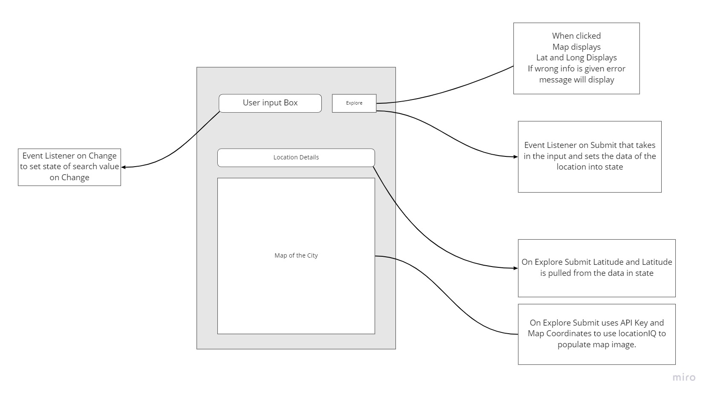
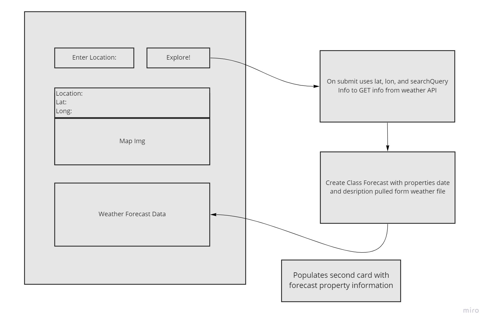

# City Explorer API

**Author**: Roger Reyes
**Version**: 1.0.0 
<!-- increment the patch/fix version number if you make more commits past your first submission -->

## Overview

This server is being used as an API for my city-explorer to pull information in order to populate certain data such as the weather forecast.

## Getting Started

In order for another user to get this program running on their machine they must have several packages from npm which include express, dotenv, and cors.

## Architecture
This server is using multiple npm packages that include express, dotenv, and cors. Future implementation will use Heroku.

## Change Log

Name of feature: #1 Setup

Estimate of time needed to complete: 1 hour

Start time: 3:30pm

Finish time: 4:10pm

Actual time needed to complete: 40 min

---
Name of feature: #2 weather file and requirement

Estimate of time needed to complete: 1 hour

Start time: 4:20pm

Finish time: 5:00pm

Actual time needed to complete: 40 min

## Credit and Collaborations
<!-- Give credit (and a link) to other people or resources that helped you build this application. -->